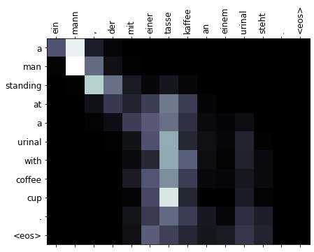
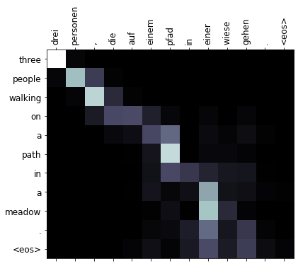
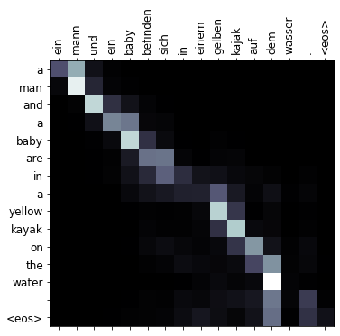
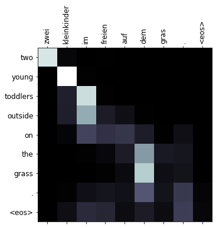

## CS626 Speech and Natural Language Processing and the Web: Project
**Efficient Neural Machine Translation**  
Anshul Tomar 170070007  
Anwesh Mohanty 170070009  
Parth Shettiwar 170070021  

**Project Description**  
Problems Encountered in NMT models    
1. Overfitting on training dataset: Occurs primarily due to high complexity of RNN models and due to discrete nature of training inputs.  
This leads to fall in results during the inference stage.  
2. Training time: Current SOTA models  take around 2-3 days to train properly on large datasets to produce their results. But there might be cases in which such large training times might not be desirable.  

To solve these problems, we:
1. Built a NMT model based on the popular RNNSearch model but with a smaller memory footprint and lower computation cost compared to SOTA models but accuracy isn’t compromised much.
2. Added an adversarial training mechanism to our model to tackle overfitting to some extent.
3. Presented a detailed characterization of model performance and how each component affects it.
4. Conducted a thorough comparative study with a SOTA transformer to show how effectively we have achieved our goals.  
  
Code Base:    
The Codes Folder contains 2 .ipynb files.  
1. Ours.ipynb  : Our NMT Model based on RNNsearch with adverserial training and noise added to avoid overfitting.  
2. Transformer.ipynb  : This model is based on **All you need is Attention** paper. We have ran the transformer on Multi30k Dataset.  

To run them, just upload them on a collab notebook, and run all cells.There is no need to download the dataset separetely, it will be automatically imported from torchtext datasets. Also all necessary libraries will be installed  in initial few blocks of notebook.       
Both models have been trained on Multi30k English-German Dataset. The final block computes the Bleu score in each. The training is done for 10 epochs and can be changed in the training bloch by varying the parameter N_EPOCHS.

The basic architecture of code consists of following:    
1)Encoder: Consists of an Embedding layer, bi-directional GRU and a Linear layer     
2)Attention Layer: A feedforward neural network to implement attention  
3)Decoder: Consists of an Embedding layer, GRU and a Linear layer   

Following are some of the attention maps generated by our model:  

  

We have conducted various abltaion studies and error analysis to further observe the performance of our model.  
The folder contains plots folder ( which contains all the plots and attention maps), Codes folder (containing the codes), our final Report and Final presentation slides.  

 
